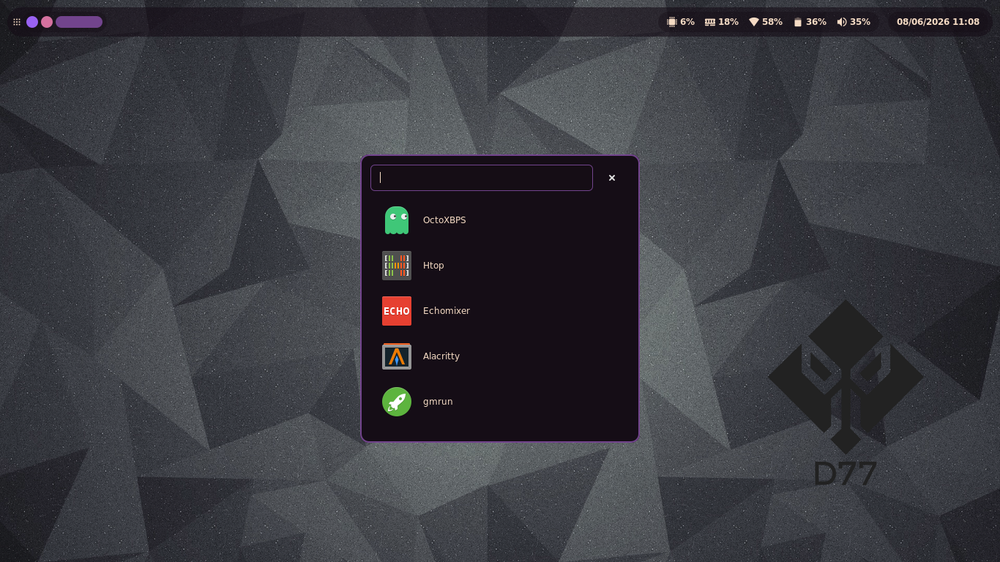

# fabric-d77

d77-shell is a simple GTK desktop shell built on top of Fabric and Python.



To install:

1 - Clone the Repository

```
git clone https://github.com/dani-77/fabric-d77.git ~/.config/fabric-d77

cd ~/.config/fabric-d77
```

2 - Create Virtual Environment

```
python -m venv venv

source venv/bin/activate

pip install -r requirements.txt
```

3 - Execute the shell

```
~/.config/fabric-d77/./start.sh
```

## OSD (volume & brightness)

The shell bundles a minimalist **OSD (On-Screen Display)** overlay (`osd.py`),
inspired by the equivalent module in
[quickshell-d77](https://github.com/dani-77/quickshell-d77). A small popup
(icon + progress bar + percentage) appears in the **top-right corner** whenever
the volume or screen brightness changes, and fades out after ~2.5 s.

- **Volume** uses the **ALSA** backend (`amixer`) with **mute/unmute** support.
- **Brightness** uses **brightnessctl**.

The OSD polls the current values and reacts to **external changes** too, so it
shows up even when your media keys are bound directly to `amixer` /
`brightnessctl`, or when another app changes the volume. It is wired into the
main shell (`main.py`) automatically — no extra setup required.

### Requirements

- `alsa-utils` (`amixer`) — the default mixer control is `Master`.
- `brightnessctl` — the user must be able to run it without a password (usually
  via the `video` group + the udev rules shipped with brightnessctl).
- A symbolic icon theme that provides `audio-volume-*-symbolic` and
  `display-brightness-*-symbolic` icons.

### Hyprland keybinds (media keys)

The simplest setup is to bind the media keys directly to the backend commands —
the OSD detects the change and pops up on its own:

```ini
bindel = , XF86AudioRaiseVolume,  exec, amixer set Master 5%+ unmute
bindel = , XF86AudioLowerVolume,  exec, amixer set Master 5%-
bindl  = , XF86AudioMute,         exec, amixer set Master toggle
bindel = , XF86MonBrightnessUp,   exec, brightnessctl set 5%+
bindel = , XF86MonBrightnessDown, exec, brightnessctl set 5%-
```

Alternatively, let the shell apply the change (and show the OSD instantly) via
real-time signals sent to the running shell:

```ini
bindel = , XF86AudioRaiseVolume,  exec, kill -s SIGRTMIN+1 $(pgrep -f main.py)
bindel = , XF86AudioLowerVolume,  exec, kill -s SIGRTMIN+2 $(pgrep -f main.py)
bindl  = , XF86AudioMute,         exec, kill -s SIGRTMIN+3 $(pgrep -f main.py)
bindel = , XF86MonBrightnessUp,   exec, kill -s SIGRTMIN+4 $(pgrep -f main.py)
bindel = , XF86MonBrightnessDown, exec, kill -s SIGRTMIN+5 $(pgrep -f main.py)
```

You can tweak the step, timeout, mixer control and poll interval at the top of
`osd.py` (`STEP`, `TIMEOUT_MS`, `MIXER_CONTROL`, `POLL_INTERVAL_MS`).

## Lock screen

`lockscreen.py` implements a **native locker** for the shell — no dependency
on swaylock/hyprlock — mirroring how the lockscreen was built in
[quickshell-d77](https://github.com/dani-77/quickshell-d77) (there via
Quickshell's built-in `WlSessionLock`). It's backed by the same underlying
mechanism: the **`ext-session-lock-v1`** Wayland protocol, via the
[GtkSessionLock](https://github.com/Cu3PO42/gtk-session-lock) library (the
same one [gtklock](https://github.com/jovanlanik/gtklock) is built on). This
means the **compositor** enforces the lock, not just a fullscreen window —
it's a real session lock, same security model as swaylock/hyprlock.

Unlocking is done via **PAM**, so it checks your normal system password.

Trigger it from the session menu's "Lock" entry, or bind a key directly:

```ini
bindl = , SUPER, L, exec, kill -s SIGRTMIN+8 $(pgrep -f main.py)
```

### Requirements

- The `gtk-session-lock` C library **and its GObject-introspection typelib**
  installed system-wide (it's a system library, not a pip package — build it
  from source per the upstream README, or install it via your distro/AUR).
- `python-pam` (already in `requirements.txt`).
- A PAM service file at **`/etc/pam.d/fabric-d77`**, e.g. on Arch:
  ```
  auth    include   system-auth
  account include   system-auth
  ```
  On Debian/Ubuntu, use `common-auth`/`common-account` instead. Without this
  file PAM fails closed (no default policy → deny), so the screen stays
  locked but nothing will unlock it.

If `gtk-session-lock` isn't installed, the compositor doesn't support the
protocol, or PAM isn't available, `lockscreen.LockScreen.lock()`
automatically falls back to `session_actions.lock()` (swaylock → hyprlock →
`loginctl lock-session`), so the shell degrades gracefully instead of
leaving you with a broken "Lock" button.

Enjoy
