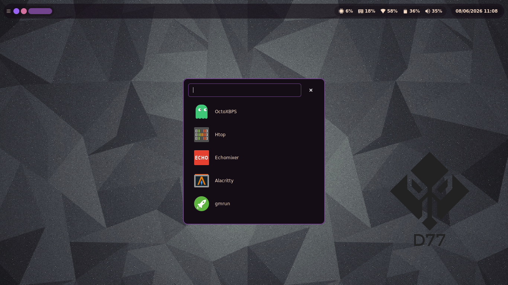

# fabric-d77

d77-shell is a simple GTK desktop shell built on top of Fabric and Python.

> This is the technical/developer reference. For a simpler end-user overview
> (what it is, install, usage, keybinds), see the [root README](../README.md).



## Installing

### Option A: Arch package (recommended)

A `PKGBUILD` is included that installs every Python dependency as a real
system package (repo + AUR) — no venv, no pip, nothing fetched at runtime.

```
git clone https://github.com/dani-77/fabric-d77.git
cd fabric-d77
makepkg -si
```

This installs the shell to `/usr/share/fabric-d77`, the `/usr/bin/fabric-d77`
launcher, `/usr/bin/fabric-d77-signal`, and the PAM service file — all at
install time, so no `sudo make install` or runtime `pkexec` prompt is needed
afterwards. Run it with `fabric-d77`, or bind it directly in your compositor
config (e.g. `exec fabric-d77` in Hyprland/sway).

### Option B: Void Linux package (no venv)

`xbps-src` templates live under `void/srcpkgs/` for the same no-venv,
system-package install on Void Linux. See [`void/README.md`](void/README.md)
for how to drop them into a `void-packages` checkout and build with
`xbps-src`.

### Option C: manual install / other distros (venv)

1 - Clone the Repository

```
git clone https://github.com/dani-77/fabric-d77.git ~/.config/fabric-d77

cd ~/.config/fabric-d77
```

2 - Create Virtual Environment

```
python -m venv venv

source venv/bin/activate

pip install -r requirements.txt
```

3 - Execute the shell

```
~/.config/fabric-d77/./start.sh
```

`start.sh` also doubles as the fallback launcher: if `/usr/share/fabric-d77`
isn't present (i.e. neither the Arch nor the Void package is installed), it
falls back to a pre-built ISO venv, then a local `venv/`, auto-creating the
latter on first run if neither exists.

## OSD (volume & brightness)

The shell bundles a minimalist **OSD (On-Screen Display)** overlay (`osd.py`),
inspired by the equivalent module in
[quickshell-d77](https://github.com/dani-77/quickshell-d77). A small popup
(icon + progress bar + percentage) appears in the **top-right corner** whenever
the volume or screen brightness changes, and fades out after ~2.5 s.

- **Volume** uses the **ALSA** backend (`amixer`) with **mute/unmute** support.
- **Brightness** uses **brightnessctl**.

The OSD polls the current values and reacts to **external changes** too, so it
shows up even when your media keys are bound directly to `amixer` /
`brightnessctl`, or when another app changes the volume. It is wired into the
main shell (`main.py`) automatically — no extra setup required.

### Requirements

- `alsa-utils` (`amixer`) — the default mixer control is `Master`.
- `brightnessctl` — the user must be able to run it without a password (usually
  via the `video` group + the udev rules shipped with brightnessctl).
- A symbolic icon theme that provides `audio-volume-*-symbolic` and
  `display-brightness-*-symbolic` icons.

### Hyprland keybinds (media keys)

The simplest setup is to bind the media keys directly to the backend commands —
the OSD detects the change and pops up on its own:

```ini
bindel = , XF86AudioRaiseVolume,  exec, amixer set Master 5%+ unmute
bindel = , XF86AudioLowerVolume,  exec, amixer set Master 5%-
bindl  = , XF86AudioMute,         exec, amixer set Master toggle
bindel = , XF86MonBrightnessUp,   exec, brightnessctl set 5%+
bindel = , XF86MonBrightnessDown, exec, brightnessctl set 5%-
```

Alternatively, let the shell apply the change (and show the OSD instantly) via
real-time signals sent to the running shell, through the bundled
`fabric-d77-signal` helper (see [Idle daemons](#idle-daemons-swayidle-hypridle-)
below for what it does and how to get it):

```ini
bindel = , XF86AudioRaiseVolume,  exec, fabric-d77-signal RTMIN+1
bindel = , XF86AudioLowerVolume,  exec, fabric-d77-signal RTMIN+2
bindl  = , XF86AudioMute,         exec, fabric-d77-signal RTMIN+3
bindel = , XF86MonBrightnessUp,   exec, fabric-d77-signal RTMIN+4
bindel = , XF86MonBrightnessDown, exec, fabric-d77-signal RTMIN+5
```

`fabric-d77-signal` isn't required — the raw form also works —
but it's what keeps this safe to also drive from an idle daemon (see
[Idle daemons](#idle-daemons-swayidle-hypridle-) below):

```ini
bindel = , XF86AudioRaiseVolume,  exec, kill -s SIGRTMIN+1 $(pgrep -f main.py)
```

You can tweak the step, timeout, mixer control and poll interval at the top of
`osd.py` (`STEP`, `TIMEOUT_MS`, `MIXER_CONTROL`, `POLL_INTERVAL_MS`).

## Lock screen

`lockscreen.py` implements a **native locker** for the shell — no dependency
on swaylock/hyprlock — mirroring how the lockscreen was built in
[quickshell-d77](https://github.com/dani-77/quickshell-d77) (there via
Quickshell's built-in `WlSessionLock`). It's backed by the same underlying
mechanism: the **`ext-session-lock-v1`** Wayland protocol, via the
[GtkSessionLock](https://github.com/Cu3PO42/gtk-session-lock) library (the
same one [gtklock](https://github.com/jovanlanik/gtklock) is built on). This
means the **compositor** enforces the lock, not just a fullscreen window —
it's a real session lock, same security model as swaylock/hyprlock.

Unlocking is done via **PAM**, so it checks your normal system password.

Trigger it from the session menu's "Lock" entry, or bind a key directly:

```ini
bindl = , SUPER, L, exec, fabric-d77-signal RTMIN+8
```

(or the raw form, `kill -s SIGRTMIN+8 $(pgrep -f main.py)`, if you haven't
got the helper installed — see [Idle daemons](#idle-daemons-swayidle-hypridle-)
below for what it is).

If you also auto-lock from an idle daemon (`swayidle`, `hypridle`, …), see
[Idle daemons](#idle-daemons-swayidle-hypridle-) below — sending the lock
signal from there needs a small adjustment to avoid a nasty footgun.

### Requirements

- The `gtk-session-lock` C library **and its GObject-introspection typelib**
  installed system-wide (it's a system library, not a pip package — build it
  from source per the upstream README, or install it via your distro/AUR).
- `python-pam` (already in `requirements.txt`).
- A PAM service file at **`/etc/pam.d/fabric-d77`**, e.g. on Arch:
  ```
  auth    include   system-auth
  account include   system-auth
  ```
  On Debian/Ubuntu, use `common-auth`/`common-account` instead. Without this
  file PAM fails closed (no default policy → deny), so the screen stays
  locked but nothing will unlock it.

If `gtk-session-lock` isn't installed, the compositor doesn't support the
protocol, or PAM isn't available, `lockscreen.LockScreen.lock()`
automatically falls back to `session_actions.lock()` (swaylock → hyprlock →
`loginctl lock-session`), so the shell degrades gracefully instead of
leaving you with a broken "Lock" button.

### Idle daemons (swayidle, hypridle, …)

Don't put a raw `kill -s SIGRTMIN+8 $(pgrep -f main.py)` (or
`pkill -f "python.*main.py"`) directly inside an idle daemon's
`timeout`/`before-sleep` command. Some idle daemons — `swayidle` in
particular — keep the full text of their configured commands in their own
process's command line for as long as they run, and also treat certain
signals specially: per `man swayidle`, `SIGUSR1` means "immediately enter
idle state" (fires all timeout commands right away). If the lock command's
`pgrep`/`pkill -f main.py` pattern is embedded in swayidle's own argv, *any
other keybind* that signals the shell with that same pattern (e.g. a
launcher toggle sending `SIGUSR1`) also matches swayidle itself — forcing
it into immediate idle and firing the lock timeout. Net effect: pressing an
unrelated keybind locks the screen.

The bundled `bin/fabric-d77-signal <SIGNAL>` script avoids this by keeping
the `pgrep`/`pkill` pattern out of any long-lived process's command line.
Install it system-wide (alongside the PAM service file) with:

```sh
sudo make install
```

This installs to `/usr/bin` rather than `~/.local/bin` — compositor-launched
commands (`exec` in sway/Hyprland, swayidle) don't reliably inherit your
login shell's `PATH`. Then wire it up instead of the raw pattern, e.g. for
sway:

```ini
exec swayidle -w \
         timeout 300 'fabric-d77-signal RTMIN+8' \
         before-sleep 'fabric-d77-signal RTMIN+8'

bindsym $mod+d exec fabric-d77-signal USR1
bindsym $mod+t exec fabric-d77-signal RTMIN+8
```

## Ollama Chat

`ollama_chat.py` adds a small popup (`OllamaChatWindow`) for chatting with a
local [Ollama](https://ollama.com) instance: a status dot, a model picker
that can pull new models on the fly, and a simple prompt/response chat
backed by Ollama's HTTP API.

There's deliberately no bar button for it — the feature isn't consistent or
reliable enough yet to earn permanent bar real estate. It still ships and
works the same as before; open it via the signal/keybind below (or run
Ollama yourself and skip the popup entirely if you'd rather use `ollama run`
or another client).

### Requirements

- A running Ollama instance reachable at `http://127.0.0.1:11434` (the
  default).
- `requests` (already in `requirements.txt`, `python-requests` in the Arch
  package, `python3-requests` in the Void package).
- The status dot polls `GET /api/version` on the Ollama HTTP API directly, so
  it works the same regardless of init system and needs no special
  permissions (querying the runit/systemd service directly required root or
  group access to the supervise dir, which regular users don't have by
  default).

Trigger it from `SIGRTMIN+9`, consistent with the other popups:

```ini
bindl = , SUPER, O, exec, fabric-d77-signal RTMIN+9
```

(or `kill -s SIGRTMIN+9 $(pgrep -f main.py)` without the helper — see
[Idle daemons](#idle-daemons-swayidle-hypridle-) below).

The chosen model is remembered across restarts at
`~/.config/ollama-chat/model.conf`.

### Hardware-based model suggestion

On first run (no model saved yet at `~/.config/ollama-chat/model.conf`), the
popup probes the machine for a dedicated GPU and auto-selects the
best-fitting *already installed* model instead of always defaulting to
`qwen2.5:0.5b`:

- `nvidia-smi` is tried first, for an exact VRAM reading.
- If that's unavailable, it falls back to `lspci`, flagging any non-Intel
  VGA/3D controller as a dedicated GPU (VRAM assumed conservatively, since
  there's no universal way to query it without vendor tooling like
  `rocm-smi`).
- No dedicated GPU found → treated as CPU-only, suggesting the smallest
  installed model.

The detected VRAM maps to a recommended parameter-count tier (0.5b through
72b, sized against the qwen2.5 family), and the largest installed model that
fits the tier is picked — falling back to the smallest installed model if
none fit. This only affects the *initial* pick: once a model is chosen
(manually or automatically), it's saved and always wins on subsequent
launches. The detection result is shown briefly in the popup's info line
(e.g. `NVIDIA GPU detected (8192MB VRAM) — auto-selected 'qwen2.5:7b'.`).

This is purely a suggestion among models you've already pulled — it never
installs anything on its own.

### First-run auto install

If Ollama is reachable but reports **zero installed models** and there's no
saved preference yet (a genuine first run, not just an empty registry blip),
the popup checks for internet (a quick `HEAD` request to ollama.com) and, if
reachable, automatically pulls `qwen2.5:0.5b` so the chat works without any
manual setup. This is called out clearly in the popup's info line, with a
**Cancel** button next to it — clicking it aborts the download immediately
(the in-progress connection is closed) instead of waiting for it to finish
or fail on its own. Cancelling, or having no internet, just leaves the model list empty; the
attempt only happens once per shell run (it won't retry on every popup
open), so pull a model manually via the picker's "install new model..."
entry, or restart the shell to trigger the check again.

Enjoy
